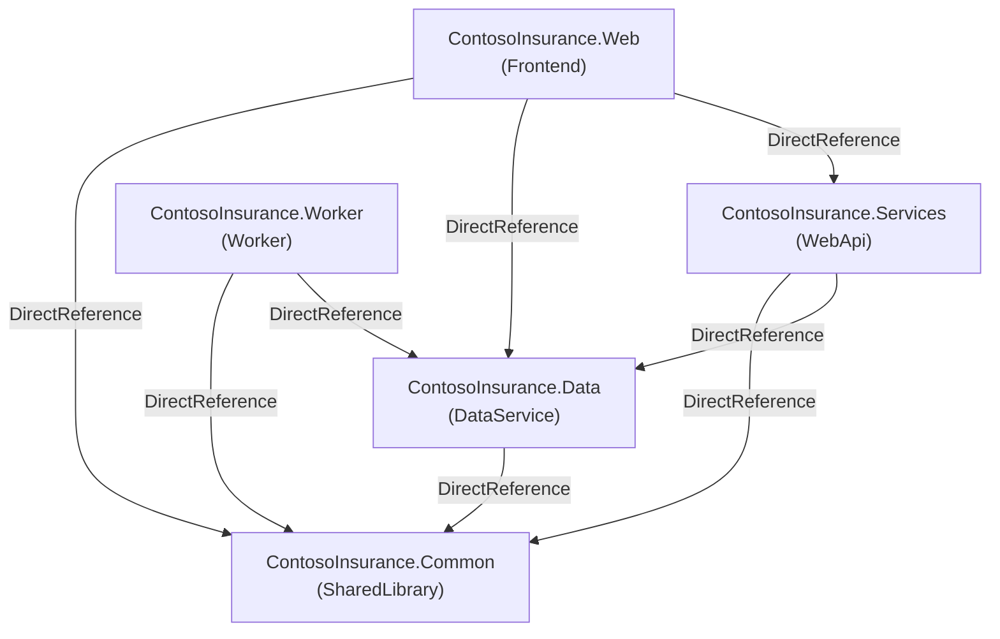

# Topology Graph: dotnet-modernization-hackathon

Analyzed 5 service(s) across 1 repository(ies) for application "dotnet-modernization-hackathon" on 2026-07-14 08:27 UTC.

## Services

## Service Details

| Service | Role | Language | Source Repository | Warnings |
|---------|------|----------|-------------------|----------|
| ContosoInsurance.Web | Frontend | dotnet | dotnet-modernization-hackathon.src.ContosoInsurance | — |
| ContosoInsurance.Services | WebApi | dotnet | dotnet-modernization-hackathon.src.ContosoInsurance | — |
| ContosoInsurance.Worker | Worker | dotnet | dotnet-modernization-hackathon.src.ContosoInsurance | — |
| ContosoInsurance.Data | DataService | dotnet | dotnet-modernization-hackathon.src.ContosoInsurance | — |
| ContosoInsurance.Common | SharedLibrary | dotnet | dotnet-modernization-hackathon.src.ContosoInsurance | — |
