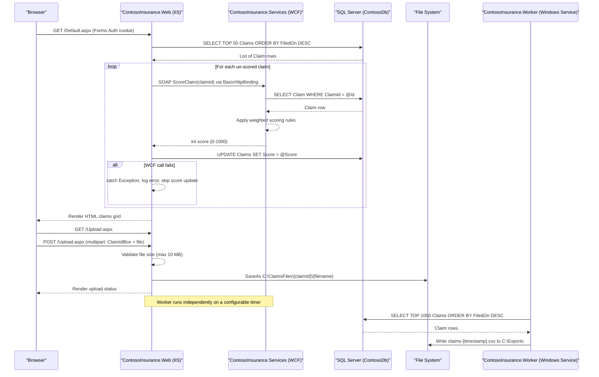

# API & Service Communication Contracts

The ContosoInsurance solution exposes a server-rendered ASP.NET WebForms UI (3 pages) and a WCF/SOAP service (2 operations); there are no REST or HTTP API endpoints. Inter-service communication is exclusively synchronous SOAP over BasicHttpBinding.

## Service Catalog

| Service | Port | Category | Purpose |
|---|---|---|---|
| ContosoInsurance.Web | 80 (IIS, HTTP) | API Layer | ASP.NET WebForms claims portal — login, claims dashboard, document upload |
| ContosoInsurance.Services | 8080 (HTTP, IIS) | Business | WCF SOAP service that scores insurance claims using deterministic weighted rules |
| ContosoInsurance.Worker | N/A (Windows Service) | Infrastructure | Timer-driven Windows Service that exports recent claims to a local CSV file on a configurable interval |
| ContosoInsurance.Data | N/A (shared library) | Infrastructure | ADO.NET data access layer; not independently deployable — referenced by Web, Services, and Worker |
| ContosoInsurance.Common | N/A (shared library) | Infrastructure | Shared utilities: ConfigHelper (appSettings/connectionStrings wrapper) and AppLogger (log4net facade) |

## API Endpoints Inventory

This application does not expose REST endpoints. The two interactive surfaces are:

### ASP.NET WebForms Pages (ContosoInsurance.Web)

| Page | HTTP Method | Path | Request Type | Response Type | Notes |
|---|---|---|---|---|---|
| Claims Dashboard | GET / POST | `/Default.aspx` | Page load (GET) / form postback (POST) | Server-rendered HTML | Fetches recent 50 claims and triggers synchronous WCF scoring for any un-scored claims on load |
| Login | GET / POST | `/Login.aspx` | GET (form) / POST `UsernameBox`, `PasswordBox` | Redirect or re-render with error | Issues Forms Authentication cookie on success |
| Document Upload | GET / POST | `/Upload.aspx` | GET (form) / POST multipart `ClaimIdBox` + file | Server-rendered status message | Saves file to local filesystem path; max 10 MB |

### WCF SOAP Operations (ContosoInsurance.Services)

| Operation | Binding | Endpoint | Request Type | Response Type | Notes |
|---|---|---|---|---|---|
| `ScoreClaim` | BasicHttpBinding | `/ClaimScoringService.svc` | `int claimId` | `int` (score 0–1000) | Returns -1 if claim not found |
| `GetModelVersion` | BasicHttpBinding | `/ClaimScoringService.svc` | _(none)_ | `string` | Returns value of `ScoringModelVersion` app setting |

## Management & Observability Endpoints

| Service | Endpoint | Custom Metrics |
|---|---|---|
| ContosoInsurance.Web | None — no health check or metrics endpoint exposed | None; log4net rolling file appender only |
| ContosoInsurance.Services | `?wsdl` (auto-generated WSDL via `serviceMetadata httpGetEnabled="true"`) | None |
| ContosoInsurance.Worker | None | None; log4net rolling file appender only |

> Note: No health check endpoints, no Swagger/OpenAPI, no Prometheus or Application Insights instrumentation exists in any service.

## DTOs & Contracts

**Service-level domain models** (all owned by `ContosoInsurance.Data`; field details in `data-architecture.md`):

| Class | API Role | Immutability |
|---|---|---|
| `Claim` | Read/write entity passed between Data, Web, Services, and Worker | Mutable POCO (no immutability construct) |
| `Policy` | Read-only in current flows; returned by `PolicyRepository.GetAll()` | Mutable POCO |
| `User` | Internal authentication model; not exposed externally | Mutable POCO |

**WCF contract** (ContosoInsurance.Services):

| Interface | Role |
|---|---|
| `IClaimScoringService` | WCF `[ServiceContract]` defining the SOAP interface; primitive types only (`int`, `string`) — no complex DTO |

There are no OpenAPI/Swagger specifications, no protobuf schemas, and no GraphQL schemas. Serialization is handled entirely by the WCF DataContractSerializer (SOAP envelope) and ASP.NET WebForms ViewState for the web layer.

## Communication Patterns

### Synchronous Communication

- **Web → WCF Service (SOAP/BasicHttpBinding)**: `Default.aspx` calls `ClaimScoringService.svc` synchronously during page load for every un-scored claim. A `ChannelFactory<IClaimScoringService>` is created, used, and torn down per call. The service endpoint is read from `appSettings["ClaimScoringEndpoint"]` (default: `http://localhost:8080/ClaimScoringService.svc`). No connection pooling or channel reuse.
- **Web / Services / Worker → SQL Server (ADO.NET)**: All three deployable components open `SqlConnection` directly using a hardcoded connection string from `appSettings`. All database calls are synchronous (no `async`/`await`).

### Asynchronous Communication

None. There is no message broker, event bus, or queue of any kind.

### Resilience Patterns

- **No circuit breaker** is configured. A WCF call failure is caught with a bare `try/catch` in `Default.aspx.cs`; on exception, the error is logged and the claim is left un-scored.
- **No retry policy** is implemented anywhere in the solution.
- **No timeout** is explicitly configured for the WCF `BasicHttpBinding` (default send/receive timeout is 1 minute).
- **No bulkhead** or rate-limiting exists.

### Service Discovery

Services communicate via hardcoded URLs read from configuration files. There is no service discovery mechanism (no Eureka, Consul, or Kubernetes DNS). The WCF endpoint address is a static app setting.

### API Gateway

None. There is no API gateway layer.

### Startup Dependency Chain

The Worker and Web projects assume SQL Server and the WCF service are already running. No startup probes or readiness checks are implemented.

### Security Posture

- **Authentication**: Forms Authentication is enabled on `ContosoInsurance.Web`. All pages deny anonymous access except `Login.aspx`. The WCF service (`ContosoInsurance.Services`) has **no authentication** configured — it is publicly accessible to any caller that can reach port 8080.
- **Authorization**: Role information (`Agent`, `Adjuster`, `Admin`) is stored in the `Users` table but is **not enforced** by any page-level or operation-level check in the current code.
- **Transport security**: **No HTTPS/TLS is configured** in any service. All traffic (browser ↔ Web, Web ↔ WCF, Worker ↔ SQL Server) travels over plain HTTP and unencrypted TCP.
- **Password storage**: SHA1 + per-user salt (weak KDF) — not a transport concern but noted for completeness.

## Service Technology Matrix

| Service | Web Framework | Data Access | Discovery | Gateway | Health Checks | Cache | Metrics |
|---|---|---|---|---|---|---|---|
| ContosoInsurance.Web | ASP.NET WebForms 4.6.1 | ADO.NET (SqlConnection) | None (hardcoded URL) | None | None | None | None |
| ContosoInsurance.Services | WCF / BasicHttpBinding 4.6.1 | ADO.NET (SqlConnection) | None | None | None | None | None |
| ContosoInsurance.Worker | Windows Service (ServiceBase) | ADO.NET (SqlConnection) | None | None | None | None | None |
| ContosoInsurance.Data | N/A (library) | ADO.NET (SqlConnection) | N/A | N/A | N/A | N/A | N/A |
| ContosoInsurance.Common | N/A (library) | N/A | N/A | N/A | N/A | N/A | N/A |

## Service Communication Sequence

The primary runtime flow is a user loading the claims dashboard (`Default.aspx`), which triggers synchronous WCF scoring calls for any un-scored claims before rendering.

