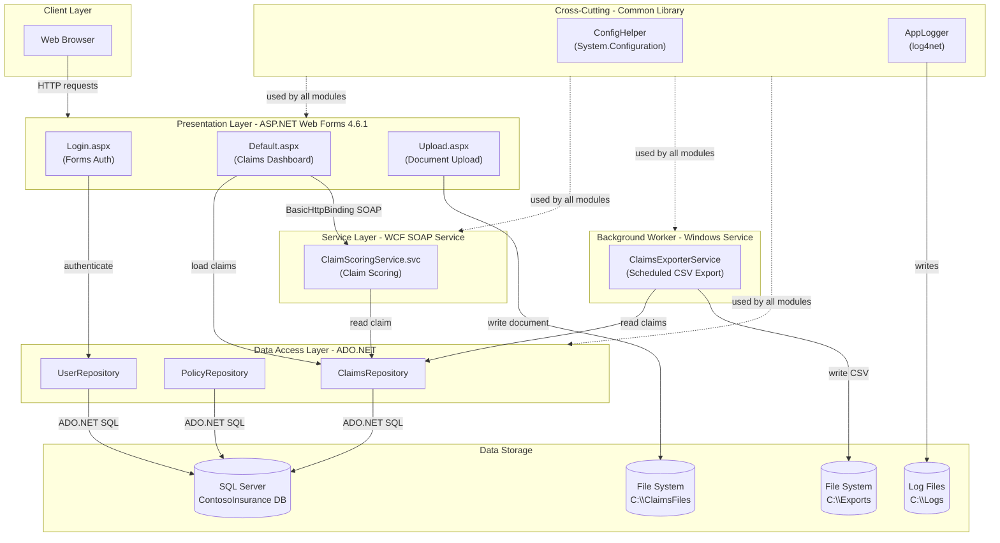
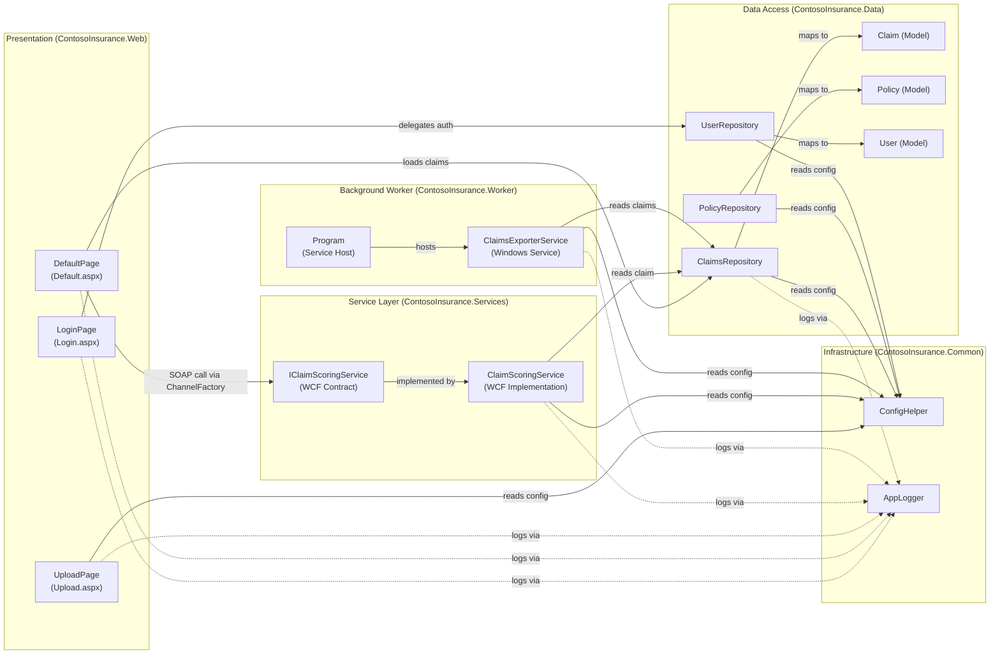

# Architecture Diagram

ContosoInsurance is a multi-project .NET Framework 4.6.1 solution providing insurance claims management via an ASP.NET Web Forms front end, a WCF scoring service, a Windows Service background worker, and a shared ADO.NET data access layer backed by SQL Server.

## Application Architecture

### Technology Stack Summary

| Layer | Technology | Version | Purpose |
|---|---|---|---|
| Presentation | ASP.NET Web Forms | 4.6.1 | Server-side web UI (ASPX code-behind pages) |
| Authentication | Forms Authentication | 4.6.1 | Cookie-based session authentication |
| Service | WCF (Windows Communication Foundation) | 4.6.1 | SOAP-based claim scoring service |
| Background Processing | Windows Service (System.ServiceProcess) | 4.6.1 | Scheduled claims CSV export |
| Data Access | ADO.NET (System.Data.SqlClient) | 4.6.1 | Raw SQL queries against SQL Server |
| Data Storage | SQL Server | Not specified | Relational storage for Claims, Policies, Users |
| Configuration | System.Configuration (Web.config/App.config) | 4.6.1 | Application settings and connection strings |
| Logging | log4net | 2.0.8 | Rolling file-based application logging |
| Serialization | Newtonsoft.Json | 11.0.2 | JSON serialization (Common/Web) |
| Cross-cutting | ContosoInsurance.Common | 1.0 | Shared config and logging utilities |

### Data Storage & External Services

The application uses a single SQL Server database (`ContosoInsurance`) accessed exclusively through raw ADO.NET in the `ContosoInsurance.Data` project. There is no ORM or query abstraction layer. The file system serves as a document store: uploaded claim documents are persisted to a configurable local path (`C:\ClaimsFiles` by default) and the background worker writes scheduled CSV exports to `C:\Exports`. Log files are written by log4net to `C:\Logs`. The WCF scoring service is called over `BasicHttpBinding` from the web layer using a hard-coded endpoint URL defined in `Web.config`.

### Key Architectural Decisions

- **Repository pattern without abstraction interfaces**: Each data entity (Claim, Policy, User) has a dedicated repository class using raw ADO.NET; no interface or DI container is used, so repositories are instantiated directly with `new`.
- **WCF SOAP for inter-service communication**: The web front end invokes claim scoring synchronously on every page load via a `ChannelFactory<IClaimScoringService>`, coupling the web tier to an external SOAP endpoint at request time.
- **Windows Service for background jobs**: Periodic export work is hosted in a traditional `ServiceBase` Windows Service with a `System.Timers.Timer`, rather than a modern hosted service or task scheduler.

## Component Relationships

### Component Inventory

| Component | Layer | Type | Responsibility |
|---|---|---|---|
| LoginPage (Login.aspx) | Presentation | ASP.NET Web Forms Page | Handles user login via Forms Authentication; delegates credential check to UserRepository |
| DefaultPage (Default.aspx) | Presentation | ASP.NET Web Forms Page | Displays recent claims dashboard; triggers WCF scoring for un-scored claims on page load |
| UploadPage (Upload.aspx) | Presentation | ASP.NET Web Forms Page | Accepts claim document file uploads and saves them to the configured local file path |
| IClaimScoringService | Service Layer | WCF Service Contract | Defines the SOAP service contract for scoring a claim by ID |
| ClaimScoringService | Service Layer | WCF Service Implementation | Implements rule-based claim scoring logic; reads claims from the database via ClaimsRepository |
| ClaimsExporterService | Background Worker | Windows Service (ServiceBase) | Runs on a configurable timer to export recent claims to a CSV file on the local file system |
| Program | Background Worker | Console/Service Entry Point | Hosts ClaimsExporterService as a Windows Service or console app |
| ClaimsRepository | Data Access | Repository | Provides CRUD and search operations on the Claims table using raw ADO.NET; includes intentional SQL injection vulnerability in SearchByClaimant |
| PolicyRepository | Data Access | Repository | Reads all policies from the Policies table using raw ADO.NET |
| UserRepository | Data Access | Repository | Looks up users and verifies passwords (SHA-1 + salt) against the Users table |
| Claim | Data Access | Domain Model | Represents a single insurance claim entity |
| Policy | Data Access | Domain Model | Represents an insurance policy entity |
| User | Data Access | Domain Model | Represents an application user with role and password hash |
| ConfigHelper | Infrastructure | Static Utility | Reads AppSettings and ConnectionStrings from Web.config/App.config at call time |
| AppLogger | Infrastructure | Static Utility | Wraps log4net with Info/Warn/Error convenience methods; also writes to System.Diagnostics.Trace |
