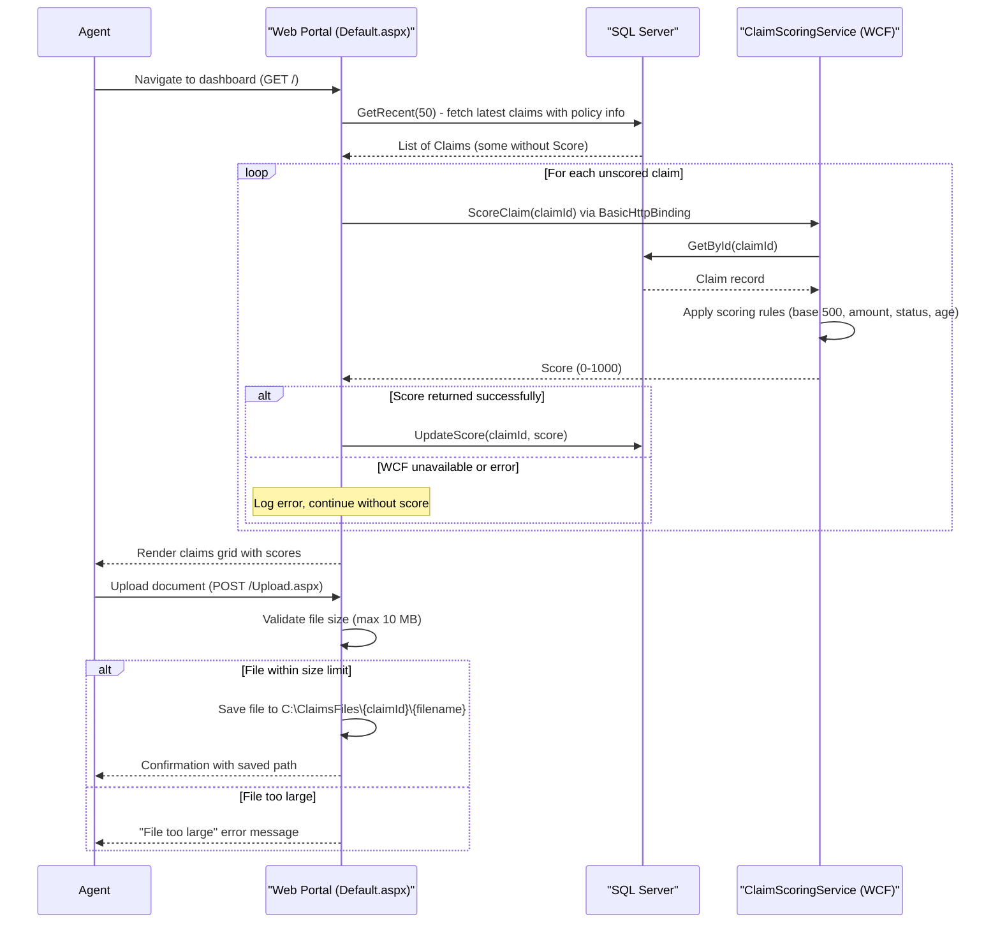

# Core Business Workflows

ContosoInsurance is a legacy insurance claims processing portal that allows agents and adjusters to file, review, score, and export insurance claims across Auto, Home, and Life product lines.

## Domain Entities

| Entity | Service / Bounded Context | Description | Key Relationships |
|--------|--------------------------|-------------|-------------------|
| User | Identity & Access | An internal staff member (Agent, Adjuster, Admin) who operates the portal | Authenticated via Forms Authentication; role determines access level |
| Policy | Policy Management | An insurance contract held by a customer, covering a specific product line (Auto, Home, Life) | A Policy has many Claims; Claims reference their Policy by PolicyId and PolicyNumber |
| Claim | Claims Management | A request for indemnification filed against a policy, progressing through a status lifecycle (Pending → Approved / Rejected → Paid) | Belongs to one Policy; may have one Document attached; may have a Score assigned by the Scoring Service |

## Service-to-Domain Mapping

| Service | Domain Context | Owned Entities | External Dependencies |
|---------|---------------|----------------|-----------------------|
| ContosoInsurance.Web (ASP.NET WebForms) | Claims Management, Identity & Access | Claim (read/write/score), Policy (read), User (authenticate) | ClaimScoringService (WCF/SOAP over HTTP), SQL Server database, local file system (C:\ClaimsFiles) |
| ContosoInsurance.Services (WCF SOAP) | Claim Scoring | Claim (read/update score) | SQL Server database |
| ContosoInsurance.Worker (Windows Service) | Claims Reporting | Claim (read) | SQL Server database, local file system (C:\Exports) |
| ContosoInsurance.Data (ADO.NET Library) | Shared Data Access | User, Policy, Claim | SQL Server (ContosoDb) |
| ContosoInsurance.Common (Class Library) | Cross-Cutting | — | System.Configuration (Web.config/App.config), log4net |

## Primary Workflows

### Workflow 1: Agent Login

An internal user navigates to the portal and authenticates before accessing any claim functionality.

1. User submits username and password via `Login.aspx`.
2. `UserRepository.FindByUsername` queries the database for the matching user record.
3. `UserRepository.VerifyPassword` recomputes SHA-1(password + salt) and compares it to the stored hash.
4. On success, `FormsAuthentication.SetAuthCookie` issues a session cookie and redirects the user to the originally requested page.
5. On failure, an error message is displayed and the attempt is logged as a warning.

### Workflow 2: Claim Dashboard and On-Demand Scoring

The default portal page displays recent claims and triggers scoring for any claim that has not yet been evaluated.

1. Agent navigates to `Default.aspx`.
2. `ClaimsRepository.GetRecent(50)` fetches the 50 most recently filed claims (joined with Policy for the policy number).
3. For each claim without a `Score`:
   - A WCF channel is opened to the `ClaimScoringService` endpoint (configured via `ClaimScoringEndpoint` app setting).
   - `IClaimScoringService.ScoreClaim(claimId)` is invoked synchronously.
   - The returned score is persisted via `ClaimsRepository.UpdateScore`.
   - Scoring failures are caught and logged; the claim is still displayed without a score.
4. The enriched claim list is bound to a data grid and rendered to the agent.

### Workflow 3: Claim Document Upload

An agent attaches a supporting document (e.g., photos, repair estimates) to an existing claim.

1. Agent opens `Upload.aspx`, enters the Claim ID, and selects a file.
2. File size is validated against `MaxUploadBytes` (default 10 MB); oversized files are rejected.
3. A folder is created at `ClaimDocumentsRoot\{claimId}\` (default: `C:\ClaimsFiles\{claimId}\`).
4. The file is saved using the original client-supplied filename.
5. The saved path is logged; a confirmation message is displayed to the agent.

> Note: The document path is stored in the `Claim.DocumentPath` field when the claim is inserted, but the upload workflow does not update this field post-upload.

### Workflow 4: Scheduled Claims Export (Windows Service)

A background Windows Service periodically exports claim data to CSV files for downstream reporting or archival.

1. `ClaimsExporterService` starts (or restarts) and immediately runs an initial export.
2. A `System.Timers.Timer` fires at the configured interval (`ExportIntervalMinutes`, default 60 minutes).
3. `ClaimsRepository.GetRecent(1000)` retrieves the 1,000 most recent claims.
4. A timestamped CSV file (`claims-YYYYMMDD-HHmmss.csv`) is written to the `ExportRoot` directory (default: `C:\Exports\`).
5. Columns exported: ClaimId, PolicyNumber, ClaimantName, Amount, Status, FiledOn, Score.
6. Errors during export are caught and logged; the timer continues for the next scheduled run.

## Cross-Service Data Flows

**Web Portal → WCF Scoring Service**

The Web portal (`Default.aspx`) acts as the orchestrator for claim scoring. For each unscored claim displayed on the dashboard, the portal opens a `BasicHttpBinding` WCF channel to `ClaimScoringService`, calls `ScoreClaim`, and writes the result back to the database. The WCF service independently re-fetches the claim from the database to compute the score. There is no shared in-memory state — both sides use the same SQL Server database as the source of truth.

Fallback behavior: if the WCF call fails (network error, service unavailable), the exception is caught and logged. The claim is shown on the dashboard without a score; scoring is retried on the next page load.

**Web Portal → File System (Documents)**

Document upload writes directly to a UNC-style local path (`C:\ClaimsFiles\{claimId}\{filename}`). There is no document registry or database reference updated at upload time, so the file system is the de-facto document store, decoupled from the claims database record.

**Windows Service → File System (Exports)**

The Worker service reads directly from SQL Server and writes CSV files to a local export path (`C:\Exports\`). No message queue or API mediates this flow; the service is entirely self-contained.

## Business Workflow Sequence

## Business Rules & Decision Logic

### Claim Scoring Rules

The `ClaimScoringService` computes a risk score (0–1000) using deterministic weighted rules:

| Rule | Condition | Score Adjustment |
|------|-----------|-----------------|
| Base score | Always | +500 |
| High-value claim | Amount > $10,000 | −150 |
| Standard-value claim | Amount ≤ $10,000 | +50 |
| Non-pending status | Status ≠ "Pending" | −25 |
| Aged claim | Filed more than 30 days ago | −75 |
| Recent claim | Filed within 30 days | +25 |
| Score bounds | Always | Clamped to [0, 1000] |

### Claim Status Lifecycle

Claims progress through the following statuses:

`Pending` → `Approved` or `Rejected` → `Paid`

- New claims are inserted with status `Pending` (default applied in `ClaimsRepository.Insert` if not provided).
- `ClosedOn` is set when a claim transitions out of the active state.

### File Upload Constraints

- Maximum file size: configurable via `MaxUploadBytes` (default 10 MB).
- Upload target directory: configurable via `ClaimDocumentsRoot` (default `C:\ClaimsFiles`).
- Sub-folder per claim ID is created automatically.

### Policy Product Lines

Policies are categorized into three product lines: **Auto**, **Home**, and **Life**. Product line is a free-text field on the Policy entity with no enforced enumeration in application code.

### User Roles

| Role | Description |
|------|-------------|
| Agent | Files claims and uploads documents on behalf of policyholders |
| Adjuster | Reviews and scores claims; determines approval or rejection |
| Admin | Full access; manages users and system configuration |

Role is stored as a string on the `User` entity. No role-based authorization gates are enforced programmatically in the Web project code (authorization relies on Forms Authentication session only).

### Export Scheduling

- Export interval: configurable via `ExportIntervalMinutes` (default 60 minutes).
- Export directory: configurable via `ExportRoot` (default `C:\Exports`).
- Export scope: top 1,000 most recently filed claims.
- A single export run failure does not stop subsequent scheduled runs.

### Cross-Cutting Concerns

- **Transactions**: No explicit database transactions are used. `Insert` and `UpdateScore` each execute as single atomic SQL statements. Multi-step operations (e.g., insert + score + update) are not wrapped in a transaction, creating a window for partial state.
- **Error handling**: All scoring errors on the dashboard are caught and logged; the portal degrades gracefully by displaying unscored claims. Export errors are caught and logged by the Worker; the timer continues.
- **Audit/logging**: All significant operations (claim insertion, score updates, document saves, export runs, login failures) are logged via `AppLogger` to log4net and `System.Diagnostics.Trace`.
- **Authentication**: Forms Authentication cookie-based sessions. No role-based access control enforced in code; all authenticated users can access all pages.
