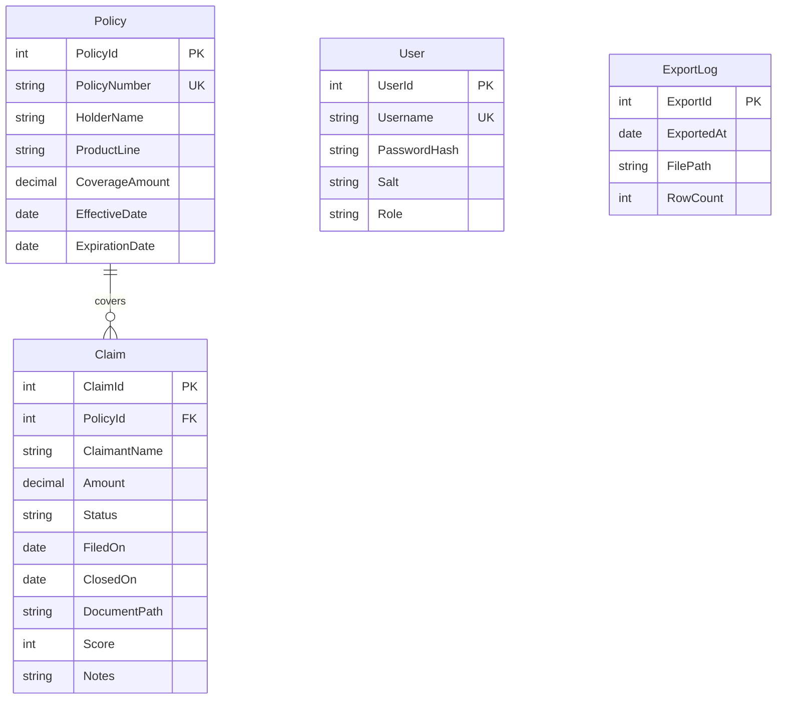

# Data Architecture & Persistence Layer

The application persists data in a single Microsoft SQL Server database (`ContosoInsurance`) accessed via raw ADO.NET across three entities (Users, Policies, Claims) and one audit table (ExportLog); no ORM is used.

## Database Configuration

| Service / Module | DB Type | Profile | Driver | Connection | Migration Tool |
|---|---|---|---|---|---|
| ContosoInsurance.Data | Microsoft SQL Server | All (single profile) | `System.Data.SqlClient` (ADO.NET) | Named connection string `ContosoDb` read from `Web.config` / `App.config` via `System.Configuration.ConfigurationManager` | None — schema is managed by hand-authored SQL scripts (`db/001-schema.sql`, `db/002-seed.sql`). DDL is applied manually; the application does not run migrations at startup. See `configuration-inventory.md` for the raw connection-string key. |

## Data Ownership per Service

| Service | Tables Owned | ORM Framework | Caching | Notes |
|---|---|---|---|---|
| ContosoInsurance.Data | `dbo.Users`, `dbo.Policies`, `dbo.Claims`, `dbo.ExportLog` | None — raw ADO.NET (`SqlConnection` / `SqlCommand`) | None | All three consumer projects (Web, Services, Worker) instantiate repository classes directly from this assembly. Logical data boundary, not physical schema separation. |
| ContosoInsurance.Web | Reads/writes `dbo.Claims` via `ClaimsRepository` | — | None | Web Forms page calls `ClaimsRepository.GetRecent` and `UpdateScore` on every page load. |
| ContosoInsurance.Services | Reads `dbo.Claims` via `ClaimsRepository` | — | None | WCF `ClaimScoringService` calls `ClaimsRepository.GetById` to score a claim. |
| ContosoInsurance.Worker | Reads `dbo.Claims` via `ClaimsRepository` | — | None | `ClaimsExporterService` calls `ClaimsRepository.GetRecent(1000)` and writes CSV files to a local path. The `dbo.ExportLog` table exists in the schema but is not written by the current code. |

## Entity Model

**Transaction management:** No explicit transaction scope is configured. Each repository method opens and closes its own `SqlConnection`; there is no ambient `TransactionScope` or unit-of-work pattern.

**Indexes:** `IX_Claims_FiledOn DESC` exists on `dbo.Claims` to support the ordered `GetRecent` query.

## Key Repository Methods

| Service | Repository | Notable Methods | Purpose |
|---|---|---|---|
| ContosoInsurance.Data | `ClaimsRepository` (`ClaimsRepository.cs`) | `GetRecent(int top = 50)` | Returns the most recent N claims joined to `dbo.Policies`, ordered by `FiledOn DESC`. Used by Web dashboard and Worker export. |
| ContosoInsurance.Data | `ClaimsRepository` | `GetById(int claimId)` | Single-row lookup by primary key, used by WCF scoring service. |
| ContosoInsurance.Data | `ClaimsRepository` | `SearchByClaimant(string namePart)` | **Legacy SQL injection risk** — user input is concatenated directly into the SQL string instead of using a parameterized query. |
| ContosoInsurance.Data | `ClaimsRepository` | `Insert(Claim claim)` | Inserts a new claim and returns the new `ClaimId` via `SCOPE_IDENTITY()`. |
| ContosoInsurance.Data | `ClaimsRepository` | `UpdateScore(int claimId, int score)` | Sets the `Score` column on a single claim row. Called after WCF scoring response. |
| ContosoInsurance.Data | `PolicyRepository` (`PolicyRepository.cs`) | `GetAll()` | Full table scan of `dbo.Policies`. No pagination. |
| ContosoInsurance.Data | `UserRepository` (`UserRepository.cs`) | `FindByUsername(string username)` | Parameterized lookup of a user by username for authentication. |
| ContosoInsurance.Data | `UserRepository` | `VerifyPassword(User user, string password)` | **Legacy weak hashing** — computes SHA1(password + salt) and compares; SHA1 is cryptographically inadequate for password storage. |

## Caching Strategy

No caching layer is present in the application. There is no use of `System.Runtime.Caching`, `IMemoryCache`, `IDistributedCache`, Redis, or any second-level cache. Every request to retrieve data issues a new `SqlConnection` and SQL query.

`ConfigHelper` reads `Web.config` / `App.config` values at call-time with no in-process caching; configuration values are re-read on every invocation.

## Data Ownership Boundaries

**Shared database, shared schema:** All modules connect to the same `ContosoInsurance` SQL Server database using the same named connection string (`ContosoDb`). There is no schema-per-service, no separate read/write replicas, and no event-sourcing or CQRS pattern.

**Cross-service data access:** `ContosoInsurance.Web`, `ContosoInsurance.Services`, and `ContosoInsurance.Worker` all take a direct dependency on `ContosoInsurance.Data` and instantiate repository classes in-process. There is no REST/message-based indirection between modules and the data layer — all data access is synchronous, in-process ADO.NET against the shared database.

**Read/write patterns:** The Web layer is the primary writer (claim intake via `Insert`). The WCF service performs a targeted single-row read and triggers a score write-back through the Web layer. The Worker performs a bulk read (`GetRecent(1000)`) for CSV export on a timer.

### Data Classification & Sensitivity

| Entity | Sensitive Fields | Classification | Controls in Place |
|---|---|---|---|
| `dbo.Users` | `Username`, `PasswordHash`, `Salt` | PII — authentication credentials | `PasswordHash` is stored (SHA1 + per-user salt). SHA1 is cryptographically weak; no modern KDF (PBKDF2, Argon2, bcrypt) is used. No field-level encryption or masking. |
| `dbo.Policies` | `HolderName`, `CoverageAmount` | PII / financial | `HolderName` is a natural-person name stored as plaintext `NVARCHAR`. No encryption-at-rest, no data masking, no access controls beyond database-level permissions. |
| `dbo.Claims` | `ClaimantName`, `Amount`, `DocumentPath` | PII / financial | `ClaimantName` is stored as plaintext. `DocumentPath` exposes local filesystem paths (`C:\ClaimsFiles\...`). No encryption-at-rest, no masking, no field-level access control. |
| `dbo.ExportLog` | `FilePath` | Internal | Stores local file paths only. No personal data. |
