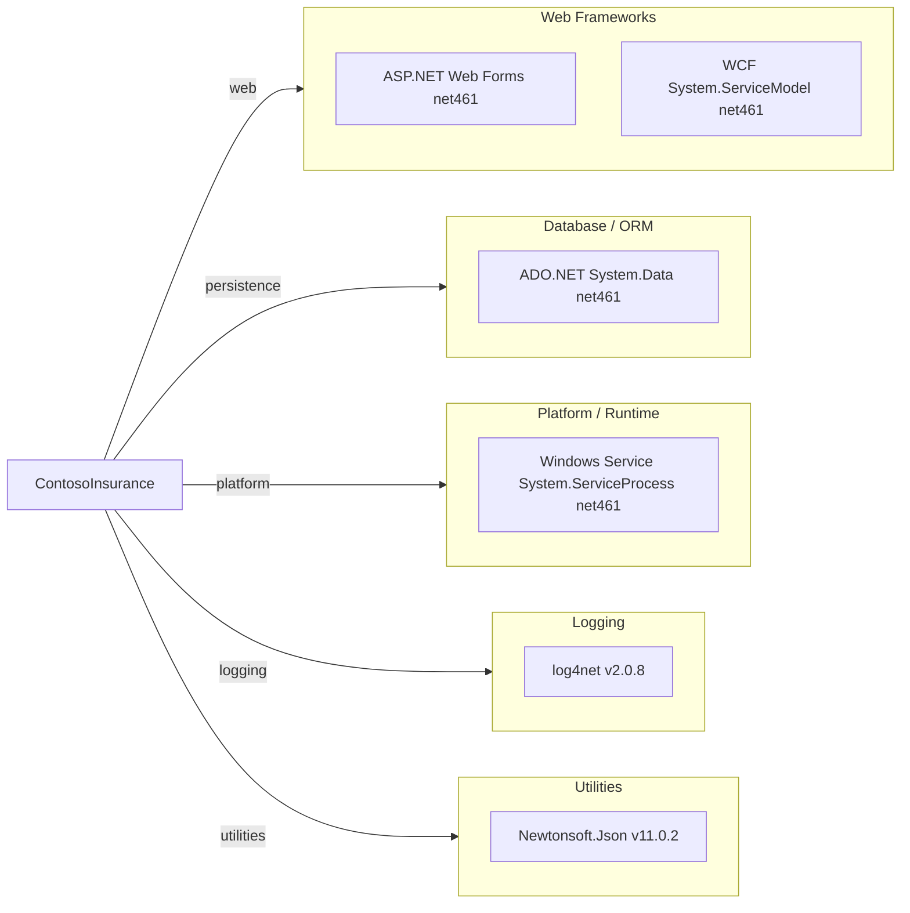

# Dependency Map

ContosoInsurance is a multi-module .NET Framework 4.6.1 solution comprising 5 projects. It declares 2 unique external NuGet packages alongside several built-in .NET Framework assemblies used as first-party dependencies.

## Dependencies

### Dependency Summary

| Category | Count | Key Libraries | Notes |
|----------|-------|---------------|-------|
| Web Frameworks | 2 | ASP.NET Web Forms, WCF System.ServiceModel | Legacy stack on .NET Framework 4.6.1; Web Forms and WCF have no equivalent in .NET 8+ |
| Database / ORM | 1 | ADO.NET System.Data | Raw ADO.NET with no ORM abstraction layer |
| Platform / Runtime | 1 | Windows Service System.ServiceProcess | Windows-only hosting model; not portable to Linux containers |
| Logging | 1 | log4net 2.0.8 | Older logging library; last major release 2016 |
| Utilities | 1 | Newtonsoft.Json 11.0.2 | JSON serialization; superseded by System.Text.Json in .NET 8 |

### Version & Compatibility Risks

.NET Framework 4.6.1 reached end of support in April 2022 and is not cross-platform. ASP.NET Web Forms and WCF (`System.ServiceModel`) have no direct equivalents in modern .NET (8+): Web Forms must be rewritten as ASP.NET Core MVC/Razor Pages or Blazor, and WCF services must be migrated to ASP.NET Core with gRPC or REST. The Windows Service worker (`System.ServiceProcess`) is Windows-only and must be converted to a .NET Generic Host Worker Service for cross-platform or containerized deployment. `log4net 2.0.8` (released 2016) has had no major updates and should be replaced with a modern alternative such as Microsoft.Extensions.Logging with Serilog or NLog. `Newtonsoft.Json 11.0.2` is several major versions behind the current release (13.x) and can be replaced by the built-in `System.Text.Json` in .NET 8.

### Notable Observations

- **No ORM in use**: The Data layer uses raw ADO.NET (`System.Data`) with no abstraction like Entity Framework or Dapper, which increases migration effort when moving to a modern data access pattern.
- **WCF service dependency**: `ContosoInsurance.Services` exposes a WCF endpoint (`ClaimScoringService.svc`) — a technology not supported on .NET 8 without CoreWCF and significant reconfiguration.
- **Windows-only hosting**: Both the Worker (Windows Service) and Web projects depend on Windows-specific APIs (`System.ServiceProcess`, IIS/IIS Express), blocking containerization until these are replaced.
- **Minimal external NuGet footprint**: Only 2 distinct NuGet packages are used (`log4net`, `Newtonsoft.Json`), making the external dependency migration surface small; the primary effort lies in replacing .NET Framework platform APIs.

## Test Dependencies

No test projects or test-scoped dependencies were detected in any of the 5 project files or their `packages.config` files.

Total test-scope dependencies: 0

No test framework (xUnit, NUnit, MSTest) or mocking library (Moq, NSubstitute) was found. The absence of automated tests represents a significant risk for any modernization effort, as there is no safety net to validate behaviour after changes.
