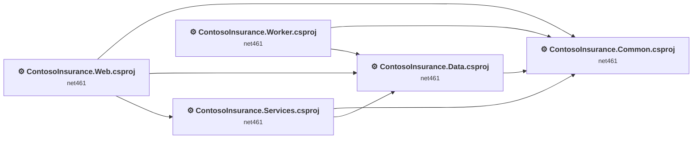
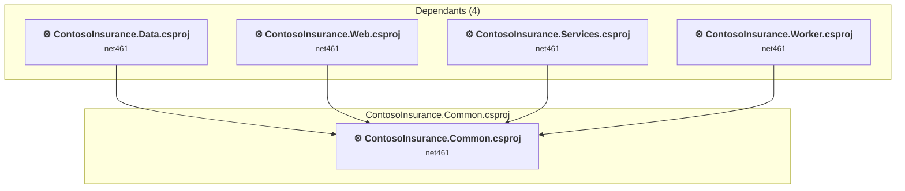
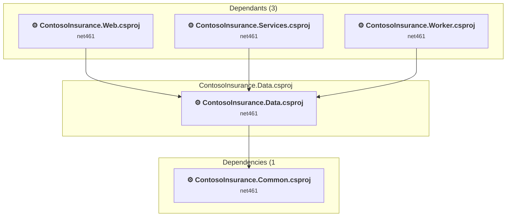
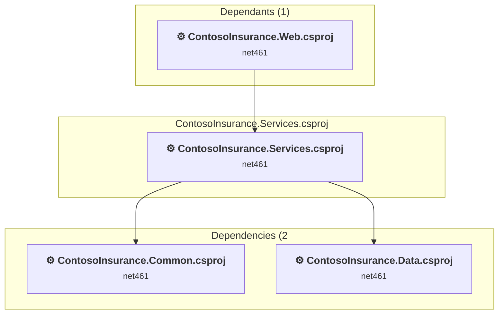
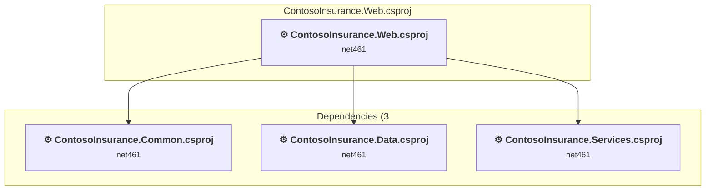
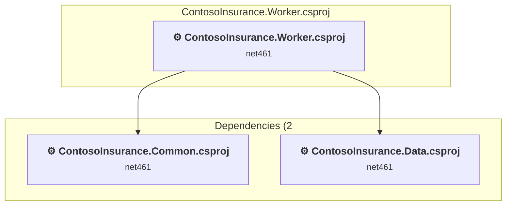

# Projects and dependencies analysis

This document provides a comprehensive overview of the projects and their dependencies in the context of upgrading to .NETCoreApp,Version=v9.0.

## Table of Contents

- [Executive Summary](#executive-Summary)
  - [Highlevel Metrics](#highlevel-metrics)
  - [Projects Compatibility](#projects-compatibility)
  - [Package Compatibility](#package-compatibility)
  - [API Compatibility](#api-compatibility)
  - [Binding Redirect Configuration](#binding-redirect-configuration)
- [Aggregate NuGet packages details](#aggregate-nuget-packages-details)
- [Top API Migration Challenges](#top-api-migration-challenges)
  - [Technologies and Features](#technologies-and-features)
  - [Most Frequent API Issues](#most-frequent-api-issues)
- [Projects Relationship Graph](#projects-relationship-graph)
- [Project Details](#project-details)

  - [ContosoInsurance.Common\ContosoInsurance.Common.csproj](#contosoinsurancecommoncontosoinsurancecommoncsproj)
  - [ContosoInsurance.Data\ContosoInsurance.Data.csproj](#contosoinsurancedatacontosoinsurancedatacsproj)
  - [ContosoInsurance.Services\ContosoInsurance.Services.csproj](#contosoinsuranceservicescontosoinsuranceservicescsproj)
  - [ContosoInsurance.Web\ContosoInsurance.Web.csproj](#contosoinsurancewebcontosoinsurancewebcsproj)
  - [ContosoInsurance.Worker\ContosoInsurance.Worker.csproj](#contosoinsuranceworkercontosoinsuranceworkercsproj)

## Executive Summary

### Highlevel Metrics

| Metric | Count | Status |
| :--- | :---: | :--- |
| Total Projects | 5 | All require upgrade |
| Total NuGet Packages | 2 | 1 need upgrade |
| Total Code Files | 22 |  |
| Total Code Files with Incidents | 17 |  |
| Total Lines of Code | 751 |  |
| Total Number of Issues | 251 |  |
| Estimated LOC to modify | 231+ | at least 30.8% of codebase |

### Projects Compatibility

| Project | Target Framework | Difficulty | Package Issues | API Issues | Binding Issues | Est. LOC Impact | Description |
| :--- | :---: | :---: | :---: | :---: | :---: | :---: | :--- |
| [ContosoInsurance.Common\ContosoInsurance.Common.csproj](#contosoinsurancecommoncontosoinsurancecommoncsproj) | net461 | 🟢 Low | 2 | 10 | 1 | 10+ | ClassicClassLibrary, Sdk Style = False |
| [ContosoInsurance.Data\ContosoInsurance.Data.csproj](#contosoinsurancedatacontosoinsurancedatacsproj) | net461 | 🟢 Low | 0 | 128 | 1 | 128+ | ClassicClassLibrary, Sdk Style = False |
| [ContosoInsurance.Services\ContosoInsurance.Services.csproj](#contosoinsuranceservicescontosoinsuranceservicescsproj) | net461 | 🔴 High | 0 | 6 | 1 | 6+ | Wap, Sdk Style = False |
| [ContosoInsurance.Web\ContosoInsurance.Web.csproj](#contosoinsurancewebcontosoinsurancewebcsproj) | net461 | 🔴 High | 2 | 24 | 1 | 24+ | Wap, Sdk Style = False |
| [ContosoInsurance.Worker\ContosoInsurance.Worker.csproj](#contosoinsuranceworkercontosoinsuranceworkercsproj) | net461 | 🟡 Medium | 0 | 63 | 1 | 63+ | ClassicDotNetApp, Sdk Style = False |

### Package Compatibility

| Status | Count | Percentage |
| :--- | :---: | :---: |
| ✅ Compatible | 1 | 50.0% |
| ⚠️ Incompatible | 0 | 0.0% |
| 🔄 Upgrade Recommended | 1 | 50.0% |
| ***Total NuGet Packages*** | ***2*** | ***100%*** |

### API Compatibility

| Category | Count | Impact |
| :--- | :---: | :--- |
| 🔴 Binary Incompatible | 52 | High - Require code changes |
| 🟡 Source Incompatible | 179 | Medium - Needs re-compilation and potential conflicting API error fixing |
| 🔵 Behavioral change | 0 | Low - Behavioral changes that may require testing at runtime |
| ✅ Compatible | 515 |  |
| ***Total APIs Analyzed*** | ***746*** |  |

### Binding Redirect Configuration

| Severity | Count | Description |
| :--- | :---: | :--- |
| 🟡Potential | 5 | May cause issues in certain scenarios |
| ***Total Binding Issues*** | ***5*** | ***Across 5 project(s)*** |

## Aggregate NuGet packages details

| Package | Current Version | Suggested Version | Projects | Description |
| :--- | :---: | :---: | :--- | :--- |
| log4net | 2.0.8 |  | [ContosoInsurance.Common.csproj](#contosoinsurancecommoncontosoinsurancecommoncsproj) [ContosoInsurance.Services.csproj](#contosoinsuranceservicescontosoinsuranceservicescsproj) [ContosoInsurance.Web.csproj](#contosoinsurancewebcontosoinsurancewebcsproj) [ContosoInsurance.Worker.csproj](#contosoinsuranceworkercontosoinsuranceworkercsproj) | ✅Compatible |
| Newtonsoft.Json | 11.0.2 | 13.0.4 | [ContosoInsurance.Common.csproj](#contosoinsurancecommoncontosoinsurancecommoncsproj) [ContosoInsurance.Web.csproj](#contosoinsurancewebcontosoinsurancewebcsproj) | NuGet package upgrade is recommended |

## Top API Migration Challenges

### Technologies and Features

| Technology | Issues | Percentage | Migration Path |
| :--- | :---: | :---: | :--- |
| Legacy Configuration System | 25 | 10.8% | Legacy XML-based configuration system (app.config/web.config) that has been replaced by a more flexible configuration model in .NET Core. The old system was rigid and XML-based. Migrate to Microsoft.Extensions.Configuration with JSON/environment variables; use System.Configuration.ConfigurationManager NuGet package as interim bridge if needed. |
| ASP.NET Framework (System.Web) | 18 | 7.8% | Legacy ASP.NET Framework APIs for web applications (System.Web.*) that don't exist in ASP.NET Core due to architectural differences. ASP.NET Core represents a complete redesign of the web framework. Migrate to ASP.NET Core equivalents or consider System.Web.Adapters package for compatibility. |
| Configuration Installation Components | 15 | 6.5% | System.Configuration installer components for deploying applications with custom installation logic that are not available for .NET Core. The installer infrastructure has been removed. Use modern deployment tools like Windows Installer XML (WiX), InstallShield, or platform-specific package managers. |
| WCF Client APIs | 12 | 5.2% | WCF client-side APIs for building service clients that communicate with WCF services. These APIs are available as exact equivalents via NuGet packages - add System.ServiceModel.* NuGet packages (System.ServiceModel.Http, System.ServiceModel.Primitives, System.ServiceModel.NetTcp, etc.) |

### Most Frequent API Issues

| API | Count | Percentage | Category |
| :--- | :---: | :---: | :--- |
| T:System.Data.SqlClient.SqlParameterCollection | 12 | 5.2% | Source Incompatible |
| P:System.Data.SqlClient.SqlCommand.Parameters | 12 | 5.2% | Source Incompatible |
| T:System.Data.SqlClient.SqlParameter | 12 | 5.2% | Source Incompatible |
| M:System.Data.SqlClient.SqlParameterCollection.AddWithValue(System.String,System.Object) | 12 | 5.2% | Source Incompatible |
| M:System.Data.SqlClient.SqlDataReader.GetString(System.Int32) | 7 | 3.0% | Source Incompatible |
| M:System.Data.SqlClient.SqlConnection.Open | 7 | 3.0% | Source Incompatible |
| T:System.Data.SqlClient.SqlCommand | 7 | 3.0% | Source Incompatible |
| M:System.Data.SqlClient.SqlCommand.#ctor(System.String,System.Data.SqlClient.SqlConnection) | 7 | 3.0% | Source Incompatible |
| T:System.Data.SqlClient.SqlConnection | 7 | 3.0% | Source Incompatible |
| M:System.Data.SqlClient.SqlConnection.#ctor(System.String) | 7 | 3.0% | Source Incompatible |
| P:System.Data.SqlClient.SqlDataReader.Item(System.String) | 7 | 3.0% | Source Incompatible |
| T:System.Data.SqlClient.SqlDataReader | 6 | 2.6% | Source Incompatible |
| T:System.ServiceProcess.ServiceStartMode | 6 | 2.6% | Source Incompatible |
| T:System.ServiceProcess.ServiceAccount | 6 | 2.6% | Binary Incompatible |
| M:System.Data.SqlClient.SqlDataReader.Read | 5 | 2.2% | Source Incompatible |
| M:System.Data.SqlClient.SqlDataReader.GetInt32(System.Int32) | 4 | 1.7% | Source Incompatible |
| M:System.Data.SqlClient.SqlCommand.ExecuteReader | 4 | 1.7% | Source Incompatible |
| M:System.Data.SqlClient.SqlDataReader.GetOrdinal(System.String) | 4 | 1.7% | Source Incompatible |
| T:System.Configuration.Install.InstallerCollection | 4 | 1.7% | Binary Incompatible |
| P:System.Configuration.Install.Installer.Installers | 4 | 1.7% | Binary Incompatible |
| M:System.Configuration.Install.InstallerCollection.Add(System.Configuration.Install.Installer) | 4 | 1.7% | Binary Incompatible |
| M:System.Data.SqlClient.SqlDataReader.GetDateTime(System.Int32) | 3 | 1.3% | Source Incompatible |
| M:System.Web.UI.Page.#ctor | 3 | 1.3% | Binary Incompatible |
| T:System.Web.UI.Page | 3 | 1.3% | Binary Incompatible |
| T:System.Configuration.ConfigurationManager | 2 | 0.9% | Source Incompatible |
| M:System.Data.SqlClient.SqlDataReader.GetDecimal(System.Int32) | 2 | 0.9% | Source Incompatible |
| M:System.ServiceModel.OperationContractAttribute.#ctor | 2 | 0.9% | Source Incompatible |
| T:System.ServiceModel.OperationContractAttribute | 2 | 0.9% | Source Incompatible |
| T:System.Web.Security.FormsAuthentication | 2 | 0.9% | Binary Incompatible |
| F:System.ServiceProcess.ServiceStartMode.Automatic | 2 | 0.9% | Source Incompatible |
| P:System.ServiceProcess.ServiceInstaller.StartType | 2 | 0.9% | Binary Incompatible |
| P:System.ServiceProcess.ServiceInstaller.Description | 2 | 0.9% | Binary Incompatible |
| P:System.ServiceProcess.ServiceInstaller.DisplayName | 2 | 0.9% | Binary Incompatible |
| P:System.ServiceProcess.ServiceInstaller.ServiceName | 2 | 0.9% | Binary Incompatible |
| T:System.ServiceProcess.ServiceInstaller | 2 | 0.9% | Binary Incompatible |
| M:System.ServiceProcess.ServiceInstaller.#ctor | 2 | 0.9% | Binary Incompatible |
| F:System.ServiceProcess.ServiceAccount.LocalSystem | 2 | 0.9% | Binary Incompatible |
| P:System.ServiceProcess.ServiceProcessInstaller.Account | 2 | 0.9% | Binary Incompatible |
| T:System.ServiceProcess.ServiceProcessInstaller | 2 | 0.9% | Binary Incompatible |
| M:System.ServiceProcess.ServiceProcessInstaller.#ctor | 2 | 0.9% | Binary Incompatible |
| M:System.Configuration.Install.Installer.#ctor | 2 | 0.9% | Binary Incompatible |
| T:System.ServiceProcess.ServiceBase | 2 | 0.9% | Source Incompatible |
| P:System.ServiceProcess.ServiceBase.AutoLog | 2 | 0.9% | Source Incompatible |
| P:System.ServiceProcess.ServiceBase.CanPauseAndContinue | 2 | 0.9% | Source Incompatible |
| P:System.ServiceProcess.ServiceBase.CanStop | 2 | 0.9% | Source Incompatible |
| P:System.ServiceProcess.ServiceBase.ServiceName | 2 | 0.9% | Source Incompatible |
| M:System.ServiceProcess.ServiceBase.#ctor | 2 | 0.9% | Source Incompatible |
| P:System.Configuration.ConnectionStringSettings.ConnectionString | 1 | 0.4% | Source Incompatible |
| T:System.Configuration.ConfigurationErrorsException | 1 | 0.4% | Source Incompatible |
| M:System.Configuration.ConfigurationErrorsException.#ctor(System.String) | 1 | 0.4% | Source Incompatible |

## Projects Relationship Graph

Legend:
📦 SDK-style project
⚙️ Classic project

## Project Details

### ContosoInsurance.Common\ContosoInsurance.Common.csproj

#### Project Info

- **Current Target Framework:** net461
- **Proposed Target Framework:** net9.0
- **SDK-style**: False
- **Project Kind:** ClassicClassLibrary
- **Dependencies**: 0
- **Dependants**: 4
- **Number of Files**: 3
- **Number of Files with Incidents**: 2
- **Lines of Code**: 89
- **Estimated LOC to modify**: 10+ (at least 11.2% of the project)

#### Dependency Graph

Legend:
📦 SDK-style project
⚙️ Classic project

### API Compatibility

| Category | Count | Impact |
| :--- | :---: | :--- |
| 🔴 Binary Incompatible | 0 | High - Require code changes |
| 🟡 Source Incompatible | 10 | Medium - Needs re-compilation and potential conflicting API error fixing |
| 🔵 Behavioral change | 0 | Low - Behavioral changes that may require testing at runtime |
| ✅ Compatible | 41 |  |
| ***Total APIs Analyzed*** | ***51*** |  |

#### Binding Redirect Configuration

| Rule | Severity | Details | Recommendation |
| :--- | :---: | :--- | :--- |
| AutoGenerateBindingRedirects not set and no manual redirects | 🟡Potential | AutoGenerateBindingRedirects is not set in ContosoInsurance.Common.csproj, no manual redirects found | Explicitly enable <AutoGenerateBindingRedirects>true</AutoGenerateBindingRedirects> or add manual binding redirects. |

#### Project Technologies and Features

| Technology | Issues | Percentage | Migration Path |
| :--- | :---: | :---: | :--- |
| Legacy Configuration System | 10 | 100.0% | Legacy XML-based configuration system (app.config/web.config) that has been replaced by a more flexible configuration model in .NET Core. The old system was rigid and XML-based. Migrate to Microsoft.Extensions.Configuration with JSON/environment variables; use System.Configuration.ConfigurationManager NuGet package as interim bridge if needed. |

### ContosoInsurance.Data\ContosoInsurance.Data.csproj

#### Project Info

- **Current Target Framework:** net461
- **Proposed Target Framework:** net9.0
- **SDK-style**: False
- **Project Kind:** ClassicClassLibrary
- **Dependencies**: 1
- **Dependants**: 3
- **Number of Files**: 7
- **Number of Files with Incidents**: 4
- **Lines of Code**: 298
- **Estimated LOC to modify**: 128+ (at least 43.0% of the project)

#### Dependency Graph

Legend:
📦 SDK-style project
⚙️ Classic project

### API Compatibility

| Category | Count | Impact |
| :--- | :---: | :--- |
| 🔴 Binary Incompatible | 0 | High - Require code changes |
| 🟡 Source Incompatible | 128 | Medium - Needs re-compilation and potential conflicting API error fixing |
| 🔵 Behavioral change | 0 | Low - Behavioral changes that may require testing at runtime |
| ✅ Compatible | 262 |  |
| ***Total APIs Analyzed*** | ***390*** |  |

#### Binding Redirect Configuration

| Rule | Severity | Details | Recommendation |
| :--- | :---: | :--- | :--- |
| AutoGenerateBindingRedirects not set and no manual redirects | 🟡Potential | AutoGenerateBindingRedirects is not set in ContosoInsurance.Data.csproj, no manual redirects found | Explicitly enable <AutoGenerateBindingRedirects>true</AutoGenerateBindingRedirects> or add manual binding redirects. |

### ContosoInsurance.Services\ContosoInsurance.Services.csproj

#### Project Info

- **Current Target Framework:** net461
- **Proposed Target Framework:** net9.0
- **SDK-style**: False
- **Project Kind:** Wap
- **Dependencies**: 2
- **Dependants**: 1
- **Number of Files**: 5
- **Number of Files with Incidents**: 2
- **Lines of Code**: 61
- **Estimated LOC to modify**: 6+ (at least 9.8% of the project)

#### Dependency Graph

Legend:
📦 SDK-style project
⚙️ Classic project

### API Compatibility

| Category | Count | Impact |
| :--- | :---: | :--- |
| 🔴 Binary Incompatible | 0 | High - Require code changes |
| 🟡 Source Incompatible | 6 | Medium - Needs re-compilation and potential conflicting API error fixing |
| 🔵 Behavioral change | 0 | Low - Behavioral changes that may require testing at runtime |
| ✅ Compatible | 29 |  |
| ***Total APIs Analyzed*** | ***35*** |  |

#### Binding Redirect Configuration

| Rule | Severity | Details | Recommendation |
| :--- | :---: | :--- | :--- |
| AutoGenerateBindingRedirects not set and no manual redirects | 🟡Potential | AutoGenerateBindingRedirects is not set in ContosoInsurance.Services.csproj, no manual redirects found | Explicitly enable <AutoGenerateBindingRedirects>true</AutoGenerateBindingRedirects> or add manual binding redirects. |

#### Project Technologies and Features

| Technology | Issues | Percentage | Migration Path |
| :--- | :---: | :---: | :--- |
| WCF Client APIs | 6 | 100.0% | WCF client-side APIs for building service clients that communicate with WCF services. These APIs are available as exact equivalents via NuGet packages - add System.ServiceModel.* NuGet packages (System.ServiceModel.Http, System.ServiceModel.Primitives, System.ServiceModel.NetTcp, etc.) |

### ContosoInsurance.Web\ContosoInsurance.Web.csproj

#### Project Info

- **Current Target Framework:** net461
- **Proposed Target Framework:** net9.0
- **SDK-style**: False
- **Project Kind:** Wap
- **Dependencies**: 3
- **Dependants**: 0
- **Number of Files**: 10
- **Number of Files with Incidents**: 5
- **Lines of Code**: 159
- **Estimated LOC to modify**: 24+ (at least 15.1% of the project)

#### Dependency Graph

Legend:
📦 SDK-style project
⚙️ Classic project

### API Compatibility

| Category | Count | Impact |
| :--- | :---: | :--- |
| 🔴 Binary Incompatible | 11 | High - Require code changes |
| 🟡 Source Incompatible | 13 | Medium - Needs re-compilation and potential conflicting API error fixing |
| 🔵 Behavioral change | 0 | Low - Behavioral changes that may require testing at runtime |
| ✅ Compatible | 54 |  |
| ***Total APIs Analyzed*** | ***78*** |  |

#### Binding Redirect Configuration

| Rule | Severity | Details | Recommendation |
| :--- | :---: | :--- | :--- |
| AutoGenerateBindingRedirects not set and no manual redirects | 🟡Potential | AutoGenerateBindingRedirects is not set in ContosoInsurance.Web.csproj, no manual redirects found | Explicitly enable <AutoGenerateBindingRedirects>true</AutoGenerateBindingRedirects> or add manual binding redirects. |

#### Project Technologies and Features

| Technology | Issues | Percentage | Migration Path |
| :--- | :---: | :---: | :--- |
| WCF Client APIs | 6 | 25.0% | WCF client-side APIs for building service clients that communicate with WCF services. These APIs are available as exact equivalents via NuGet packages - add System.ServiceModel.* NuGet packages (System.ServiceModel.Http, System.ServiceModel.Primitives, System.ServiceModel.NetTcp, etc.) |
| ASP.NET Framework (System.Web) | 18 | 75.0% | Legacy ASP.NET Framework APIs for web applications (System.Web.*) that don't exist in ASP.NET Core due to architectural differences. ASP.NET Core represents a complete redesign of the web framework. Migrate to ASP.NET Core equivalents or consider System.Web.Adapters package for compatibility. |

### ContosoInsurance.Worker\ContosoInsurance.Worker.csproj

#### Project Info

- **Current Target Framework:** net461
- **Proposed Target Framework:** net9.0
- **SDK-style**: False
- **Project Kind:** ClassicDotNetApp
- **Dependencies**: 2
- **Dependants**: 0
- **Number of Files**: 4
- **Number of Files with Incidents**: 4
- **Lines of Code**: 144
- **Estimated LOC to modify**: 63+ (at least 43.8% of the project)

#### Dependency Graph

Legend:
📦 SDK-style project
⚙️ Classic project

### API Compatibility

| Category | Count | Impact |
| :--- | :---: | :--- |
| 🔴 Binary Incompatible | 41 | High - Require code changes |
| 🟡 Source Incompatible | 22 | Medium - Needs re-compilation and potential conflicting API error fixing |
| 🔵 Behavioral change | 0 | Low - Behavioral changes that may require testing at runtime |
| ✅ Compatible | 129 |  |
| ***Total APIs Analyzed*** | ***192*** |  |

#### Binding Redirect Configuration

| Rule | Severity | Details | Recommendation |
| :--- | :---: | :--- | :--- |
| AutoGenerateBindingRedirects not set and no manual redirects | 🟡Potential | AutoGenerateBindingRedirects is not set in ContosoInsurance.Worker.csproj, no manual redirects found | Explicitly enable <AutoGenerateBindingRedirects>true</AutoGenerateBindingRedirects> or add manual binding redirects. |

#### Project Technologies and Features

| Technology | Issues | Percentage | Migration Path |
| :--- | :---: | :---: | :--- |
| Legacy Configuration System | 15 | 23.8% | Legacy XML-based configuration system (app.config/web.config) that has been replaced by a more flexible configuration model in .NET Core. The old system was rigid and XML-based. Migrate to Microsoft.Extensions.Configuration with JSON/environment variables; use System.Configuration.ConfigurationManager NuGet package as interim bridge if needed. |
| Configuration Installation Components | 15 | 23.8% | System.Configuration installer components for deploying applications with custom installation logic that are not available for .NET Core. The installer infrastructure has been removed. Use modern deployment tools like Windows Installer XML (WiX), InstallShield, or platform-specific package managers. |

