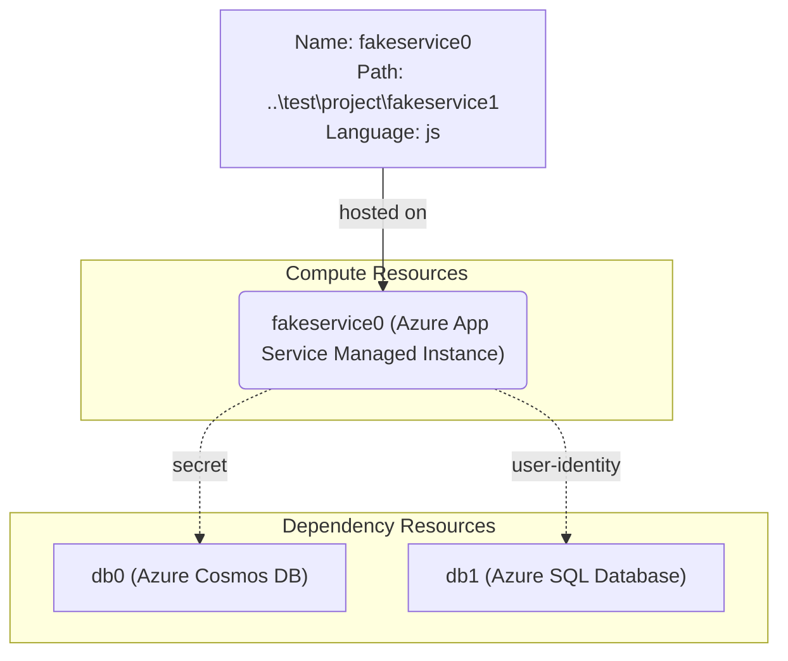

# AzCLI App Service Managed Identity Deployment

## Overview

This skill provides deployment guidance for Azure App Service Managed Identity under the AzCLI flow. It is designed to be called when Azure App Service Managed Identity is identified as the target compute host for a service.

## Output file structure:

Create a subfolder ${taskid} under ${modernization-work-folder}. Generate files strictly in the following structure. DO NOT omit or add files or folders, and use exact file names for tracking:

```
/${modernization-work-folder}/${taskid}/
├── plan.md                 # Deployment plan with architecture, execution steps, and tracking
├── progress.md             # Deployment progress with real-time updates
├── deployment-summary.md   # Summary of deployment plan for quick reference
├── deploy-scripts/         # scripts for deployment
```

**IMPORTANT - Structural Rules (DO NOT include this section in output)**
- The plan MUST strictly followed the sections listed below, in the EXACT order.
- Do NOT add any additional sections such as: "Rollback Plan", "Cost Estimation", "Documentation Links", "Post-Deployment Recommendations" or any other sections not listed.
- You MUST generate the plan file strictly following the pattern first, then execute the plan. Do NOT execute any deployment scripts before the plan file is generated.

## Workflow

{Agent should fill in and polish the markdown template below to generate a deployment plan for the project. Then save it to '/${modernization-work-folder}/${taskid}/plan.md' file. Don't add extra validation steps unless it is required! Don't change the tool name!}

# Azure Deployment Plan for TestProject Project
## **Goal**
Based on the project to provide a plan to deploy the project to Azure appservicemanagedinstance in resource group  and subscription  with tool AZCLI.

## **Project Information**
{
Summarize the project setup, example:  
**AppName**  
- **Stack**: ASP.NET Core 7.0 Razor Pages  
- **Type**: Task Manager web app with client-side JS  
- **Containerization**: Dockerfile present  
- **Dependencies**: None detected  
- **Hosting**: Azure App Service Managed Instance
}

## **Azure Resources Architecture**
> **Install the mermaid extension in IDE to view the architecture.**
(do not use </br> in strings when generating the diagram):



## **Existing Azure Resources**
| Resource Type | Name | SKU | Purpose | 
|---------------|------|-----|--------|
| Container App | myapp | Consumption |  Used to deploy project1 |
| Log Analytics | mylog | Standard  |  Not used |


** Missing resource**
{List required but missing resources.}


## **Execution Step**
> **Below are the steps for Copilot to follow; ask Copilot to update or execute this plan. Add check list for the steps.**
**CRITICAL: Do NOT run 'az login' until 'Env setup' step.**
Execution Steps:
1. Env setup for AzCLI:
    1. Install AZ CLI if not installed.
    2. Ensure there is a default subscription set. If provided, override the default subscription with the provided subscription ID.
    3. Subscription ID: Use default subscription
    4. Install Service Connector AzCLI extension: az extension add --name serviceconnector-passwordless --upgrade
2. Check Azure resources existence:
    1. Azure App Service Managed Instance for app fakeservice0:
        - name: <>, resource group: <>, subscription: <>, provisioningState: Succeeded, runningStatus: Running. Check with 'az webapp show -o json'
        - Check dependencies existence:
            1. azurecosmosdb: name: <>, resource group: <>.
            2. azuresqldatabase: name: <>, resource group: <>.
    2. Create missing resources:
        - If any resource is missing, ask user to provide the resource id or create a new one, then get the resource information with Az CLI command
        - If user want to create new resources, generate a script to do so using Azure CLI command. Run the script and confirms all resources are ready.
3. Deployment:
    1. Azure App Service Managed Instance Deployment:
        1. Create deploy script to deploy the application with Azure CLI
        2. Output: Azure CLI scripts
    2. Deployment Validation:
        1. Call tool `appmod-get-app-logs` to check application logs and ensure the services are running.
        2. Call tool `appmod-debug-app-in-browser` to debug the application in the browser if the application can be reached and tested via UI.
4. Summarize Result:
    1. Use `appmod-summarize-result` tool to summarize the deployment result.
    2. Generating files: /${modernization-work-folder}/${taskid}/deployment-summary.md

## **Progress Tracking**
- Copilot must create and update '/${modernization-work-folder}/${taskid}/progress.md' after each step.  
- Progress should include:  
  - ✅ Completed tasks  
  - 🔲 Pending tasks  
  - ❌ Failed tasks with error notes
If a script fails, log the error, regenerate/fix the script, and retry until the step completes.  
- Example format:
- [x] Containerization complete (Dockerfile found at ./Dockerfile)
- [] Deployment in progress
  - Attempt 1 failed: ACR push error (unauthorized).
  - Fixed by regenerating deploy script with correct az acr login. Retrying...

## **Tools Checklist**
- Copilot MUST call the following tools as specified in the Execution Step. Mark tools complete when called. Do not make substitutions.
- [] appmod-summarize-result  
