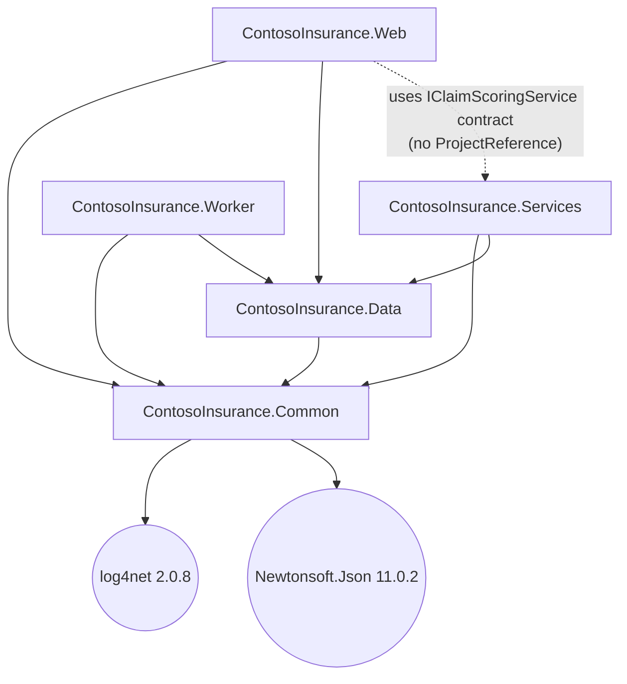

# Project Overview

> Sources: `src/ContosoInsurance/` (all projects), `src/ContosoInsurance/README.md`, `db/001-schema.sql`, `db/002-seed.sql`, `Web.config`/`App.config`, `packages.config`.

## What this app does

`ContosoInsurance` is a deliberately-legacy insurance **claims processing** sample. Insurance agents log in, view recent claims, upload claim documents, and have claims scored by a rules-based "AI" service. A background Windows Service periodically exports claims to CSV. It is a hackathon modernization target and is **not** production software.

## Current tech stack

| Area | Current state | Evidence |
|---|---|---|
| Framework | .NET Framework 4.6.1 (all projects) | `ContosoInsurance.Web/Web.config`, `ContosoInsurance.Worker/App.config` |
| Project style | Old-style `.csproj` + `packages.config` | `ContosoInsurance.Common/packages.config` |
| Frontend | ASP.NET WebForms (`.aspx` + code-behind) | `ContosoInsurance.Web/Default.aspx.cs`, `Login.aspx.cs`, `Upload.aspx.cs` |
| Service tier | WCF SOAP (`basicHttpBinding`) | `ContosoInsurance.Services/IClaimScoringService.cs` |
| Worker | Windows Service (`ServiceBase` + `System.Timers.Timer`) | `ContosoInsurance.Worker/ClaimsExporterService.cs` |
| Database | SQL Server | `db/001-schema.sql` |
| Data access | Raw ADO.NET (sync) | `ContosoInsurance.Data/ClaimsRepository.cs` |
| Logging | log4net 2.0.8 + `System.Diagnostics.Trace` | `ContosoInsurance.Common/Logging/AppLogger.cs` |
| Config | `Web.config`/`App.config` via `ConfigurationManager` | `ContosoInsurance.Common/Config/ConfigHelper.cs` |
| Auth | Forms Auth + SHA1 password hashing | `Login.aspx.cs`, `ContosoInsurance.Data/UserRepository.cs` |
| Serialization | Newtonsoft.Json 11.0.2 | `packages.config` |
| Docker/Azure/CI-CD | None present | No Dockerfile / `azure.yaml` / `.bicep` / workflow files found |

## Main projects/modules

| Project/Module | Type | Responsibility | Important files |
|---|---|---|---|
| ContosoInsurance.Common | Class library | Config + logging helpers | `Config/ConfigHelper.cs`, `Logging/AppLogger.cs` |
| ContosoInsurance.Data | Class library | ADO.NET repositories + POCO models | `ClaimsRepository.cs`, `UserRepository.cs`, `PolicyRepository.cs`, `Models/` |
| ContosoInsurance.Services | WCF service | SOAP claim scoring | `ClaimScoringService.svc.cs`, `IClaimScoringService.cs` |
| ContosoInsurance.Web | WebForms app | Agent UI: list, login, upload | `Default.aspx.cs`, `Login.aspx.cs`, `Upload.aspx.cs` |
| ContosoInsurance.Worker | Windows Service | Periodic claims CSV export | `ClaimsExporterService.cs`, `Program.cs` |

## Project reference graph

- `Common` is the only leaf; it references NuGet `log4net` and `Newtonsoft.Json` (both also referenced directly by `Web`).
- `Data` depends only on `Common`. `Services`, `Web`, and `Worker` each depend on `Common` + `Data`.
- **Gap (confirmed build break):** `Web/ContosoInsurance.Web.csproj` has **no** `ProjectReference` (and no assembly reference) to `ContosoInsurance.Services`, yet `Default.aspx.cs` uses `ContosoInsurance.Services.IClaimScoringService`. The build baseline confirms this fails at compile: `Default.aspx.cs(7,24): error CS0234`. No out-of-repo proxy exists. See [[arch-wcf-service]] and [[build-and-test]].

## Main domain concepts

| Concept | Meaning | Evidence |
|---|---|---|
| Policy | Insurance policy held by a customer | `db/001-schema.sql`, `Models/Policy.cs` |
| Claim | Claim filed against a policy | `Models/Claim.cs`, Claims table |
| Claim Score | Rules-based risk/priority score (0–1000) | `ClaimScoringService.svc.cs` |
| Claim Document | File uploaded per claim, stored on disk | `Upload.aspx.cs` |
| Export | Periodic CSV dump of claims | `ClaimsExporterService.cs`, ExportLog table |
| User/Role | Agent, Adjuster, Admin logins | `UserRepository.cs`, Users table |

## Main flows

| Flow | Summary | Important files | Unknowns |
|---|---|---|---|
| Login | Verify SHA1+salt hash, set Forms Auth cookie | `Login.aspx.cs`, `UserRepository.cs` | No logout flow exists (no `FormsAuthentication.SignOut`) — confirmed |
| View + auto-score | List 50 recent claims, score unscored via WCF | `Default.aspx.cs`, `ClaimScoringService.svc.cs` | Scoring runs on every page load |
| Upload document | Save file to `C:\ClaimsFiles\{claimId}\{filename}` | `Upload.aspx.cs` | `DocumentPath` **never** persisted (no repository call) — confirmed |
| Search by claimant | Concatenated SQL `LIKE` query | `ClaimsRepository.SearchByClaimant` | No caller anywhere — dead code — confirmed |
| Nightly export | Timer writes CSV of ≤1000 claims to `C:\Exports` | `ClaimsExporterService.cs` | `ExportLog` table **never** written — confirmed |

## Runtime/deployment model

Web + WCF run under IIS; the Worker runs as a Windows Service (`ServiceBase.Run`). SQL Server (or LocalDB) hosts the database. The app depends on local `C:\` paths for documents, exports, and logs. There is no containerization, IaC, or CI/CD in the repo. See [[arch-infrastructure]].

## Main risks / legacy constraints

- SQL injection in `ClaimsRepository.SearchByClaimant` (string concatenation).
- SHA1 password hashing (`UserRepository.HashSha1`).
- Plaintext SQL credentials in all config files.
- Path traversal risk in `Upload.aspx.cs` (client filename used directly).
- Hard dependency on `C:\` filesystem (documents, exports, logs).
- Vulnerable/outdated packages: log4net 2.0.8, Newtonsoft.Json 11.0.2.
- WCF, WebForms, and Windows Service hosting are not cloud/container-native.

## Resolved findings (2026-07-13 inspection)

- `ExportLog` table is **never** written — no model/repository exists. Confirmed unused by code.
- `SearchByClaimant` has **no caller** anywhere — confirmed dead code.
- Upload **never** persists `DocumentPath` to the DB — confirmed (saves file to disk only).
- **No logout flow** exists anywhere (no `FormsAuthentication.SignOut`) — confirmed.
- **No role-based authorization** exists; `User.Role` is stored/read but never enforced — confirmed.
- `Services` project has **no** log4net configuration and never calls `AppLogger.Configure()` — confirmed.

## Unknowns still open

- No automated test project found — is any expected? `Pendiente/Unknown`.
